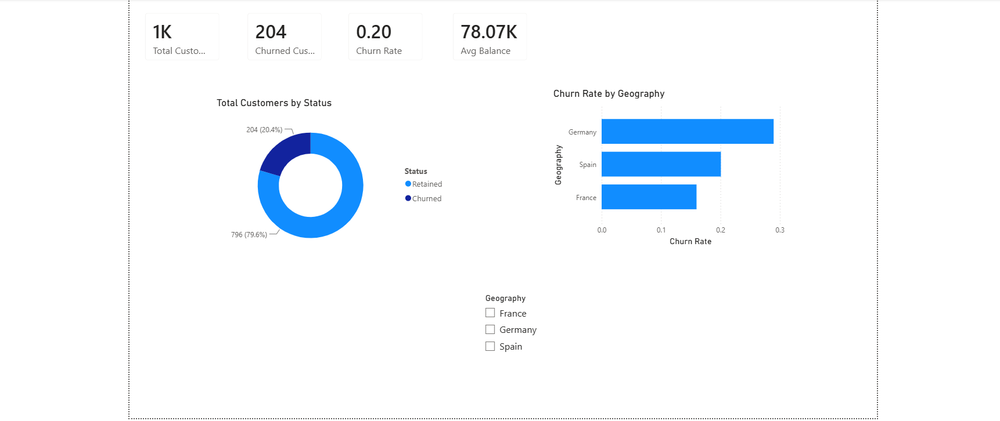
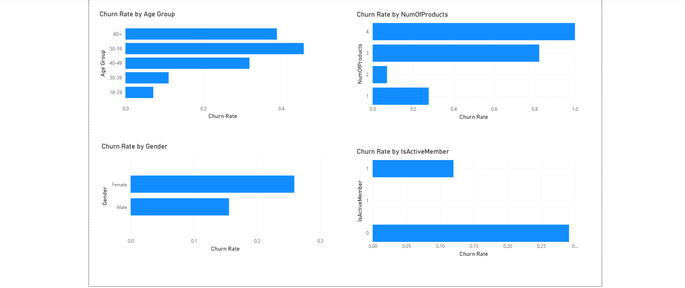
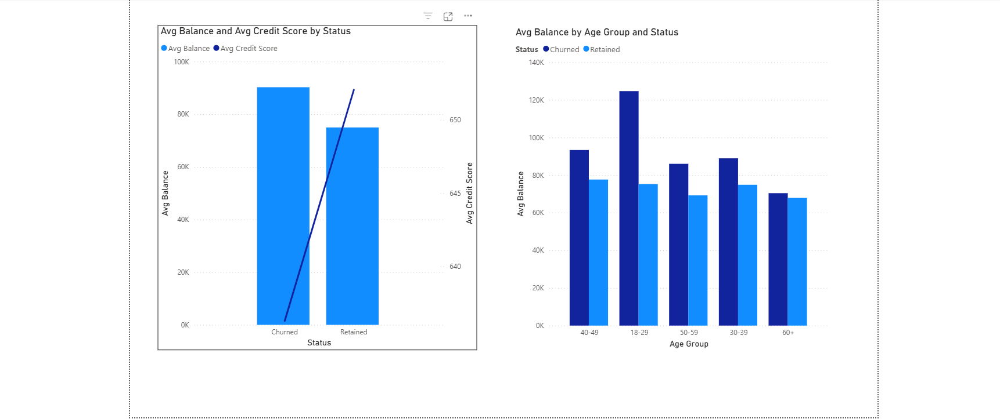

# Bank Customer Churn Analysis

## Objective
Analyzed a dataset of 10,000 bank customers to identify key churn drivers 
using SQL for data extraction and analysis, and Power BI for visualization 
— with the goal of producing actionable retention recommendations.

## Tools Used
SQL (MySQL), Power BI, DAX

## Process
1. Loaded raw customer data into a MySQL database
2. Wrote 10 analytical SQL queries covering churn rate by geography, age, 
   gender, product holding, account activity, tenure, and credit card 
   ownership — including CTEs and window functions (RANK)
3. Built a 3-page interactive Power BI dashboard with KPI tracking, 
   demographic segmentation, and financial profile comparisons
4. Translated findings into business recommendations

## Key Insights
- Germany churns at nearly 2x the rate of Spain/France (32.44% vs ~16%)
- Customers holding 3-4 products churn far more than those with 1-2 
  (82.71%/100% vs 27.71%/7.60%)
- Customers aged 50-59 are the highest-risk segment (56.04% churn)
- Inactive members churn at ~2x the rate of active members (26.87% vs 14.27%)

Full breakdown with recommendations in [insights.md](insights.md).

## Dashboard

### Overview
KPI summary, churn split, and churn rate by geography.

### Demographics
Churn rate by age group, gender, product holding, and activity status.

### Financial Profile
Average balance and credit score comparison, and balance by age group, 
split by churn status.

## SQL Highlights
See [sql/churn_queries.sql](sql/churn_queries.sql) for the full query set, 
including CTEs (tenure analysis) and window functions (RANK for top 
high-balance churned customers).

## Related Projects
- [Content Investment Gap Analysis](https://github.com/dhivyashrirethinakumar-06/youtube-content-gap-analysis) — SQL + Tableau (Media Analytics)
